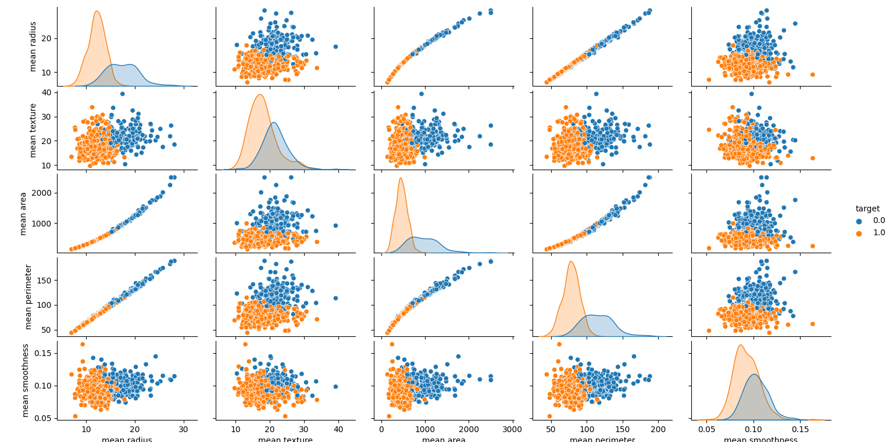
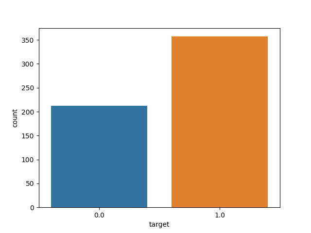

# Breast Cancer Classification

### PROBLEM STATEMENT

- Predicting if the cancer diagnosis is benign or malignant based on several observations/features
- 30 features are used, examples: 
<nbsp> - radius (mean of distances from center to points on the perimeter) 
<nbsp> - texture (standard deviation of gray scale values) 
<nbsp> - perimeter 
<nbsp> - area 
<nbsp> - smoothness (local variation in radius length) 
<nbsp> - compactness (perimeter^2/area -1.0) 
<nbsp> - concavity (severity of concave portions of the contour) 
<nbsp> - concave points (Number of concave portions on the contour) 
<nbsp> - symmetry 
<nbsp> - fractal dimension ("coastline approximation"-1)
- Datasets are linearly separable using all 30 input features
- Number of Instances: 569
- Class Distribution: 212 Malignant, 357 Benign
- Target Class:  
<nbsp> - Malignant 
<nbsp> - Benign 

### Dataset
Link: https://archive.ics.uci.edu/ml/datasets/breast+cancer+wisconsin+(Diagnostic)   
### Algorithm
Support Vector Machine 
Libraries used: numpy, pandas, matplotlib, seaborn, sklearn

### Data Visualization
- Using pair plot:

- Using count plot:

- Using scatter plot:

- Using heatmap:

### Trained Model
Heatmap of confusion matrix:
